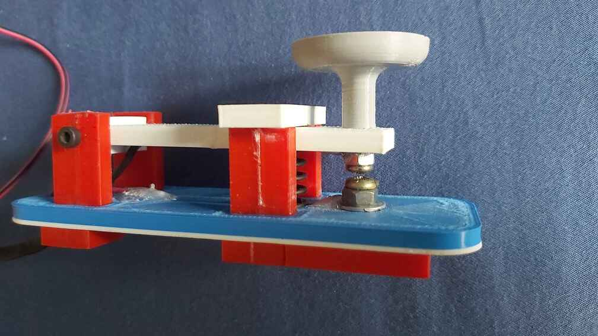
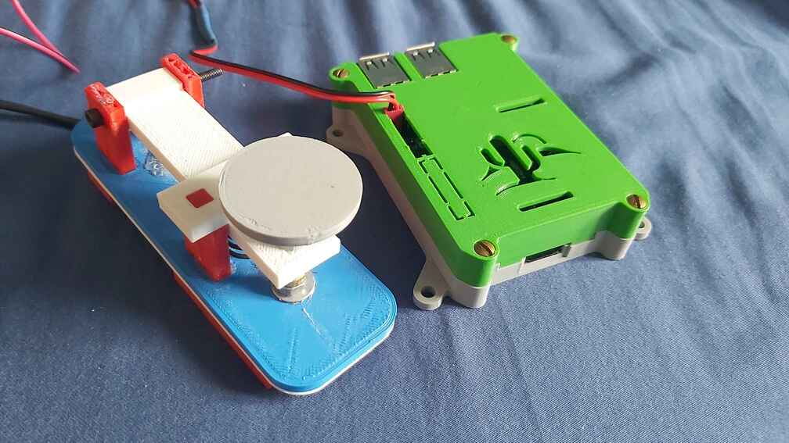

# Interpréteur Manipulateur Morse

## Description
Un manipulateur Morse branchable en USB qui émule un clavier.
Le projet contient le firmware en C (utilisant gpiod) pour lire un interrupteur physique fabriqué en 3D.

## Fonctionnalités

### Interpréteur

- Affiche le temps en ms entre les changements d'état (ouvert/fermé).

### Programme de test

- Permet d'essayer le hardware.
- Reconnais les signaux court et long et les affiches.

## Objectifs du projet

- Crée un appareil similaire à un clavier à une touche
- Exploiter les GPIO d'un Raspberry Pi en C
- Apprendre le morse

## Matériel Requis 
- Raspberry Pi (ou autres cartes compatibles GPIO)
- Interrupteur 
- Fils de connexions





## Logiciel & dépendances
- Langages : C
- Dépendances : gpiod

```
sudo apt update
sudo apt install -y libgpiod-dev libgpiod2 gpiod build-essential
```
Pour les tests avec Python
```
sudo apt install -y python3 python3-pip
pip3 install gpiod
```

## Lancer le projet

Cloner le projet sur le Raspberry Pi

Essai rapide avec Python pour vérifier le hardware.
```
python3 manipulateur_morse.py
```

Recompiler le projet avec le Makefile et lancer l'exécutable :
```
make
./bin/main
```

## Licence
Ce projet est distribué sous la licence **MIT**.

## Statut du projet
Ce projet est en cours de développement.
